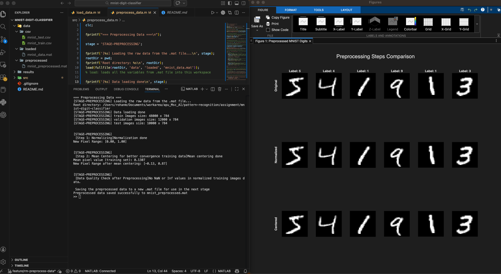

# MNIST Digit Classifier

**Course:** CT104-3-M Pattern Recognition  
**Institution:** Asia Pacific University of Technology & Innovation (APU)  
**Assignment:** Handwritten Digit Recognition System

Pattern Recognition assignment for classifying handwritten digits (0-9) using the MNIST dataset.

## Team Members
- LOH HOI PING
- TEE MUN CHUN
- ROHAN MAZUMDAR

## Project Structure (Draft - Subject to Change as per team discussion)
```
mnist-digit-classifier/
├── data/              # Dataset files (CSV and .mat)
├── src/               # Source code
├── results/           # Output results
└── README.md
```

## Planned Pipeline Structure (Draft - Subject to Change as per team discussion)
```
src/
├── load_data.m              # Load and explore MNIST dataset
├── preprocess_data.m        # Normalize and clean data (TODO)
├── extract_features.m       # Feature extraction: PCA, HOG, etc. (TODO)
├── train_model.m            # Train classifiers (k-NN, SVM, etc.) (TODO)
├── evaluate_model.m         # Performance metrics and analysis (TODO)
└── main_pipeline.m          # Run complete workflow (TODO)
```

**Workflow:** Each script processes data and saves output for the next step.

## How to Run Locally

### Prerequisites
- MATLAB installed on your system OR Install MATLAB extension (by MathWorks) in VSCODE
- Git installed

### Setup Steps

1. **Clone the repository**
```bash
    git clone https://github.com/rohan1443/mnist-digit-classifier.git
    cd mnist-digit-classifier
```

2. **Download MNIST Dataset Manually**
   - Go to: https://www.kaggle.com/datasets/oddrationale/mnist-in-csv/data
   - Click the **Download** button (may need to create free Kaggle account)
   - Extract the downloaded `archive.zip` file
   - You'll get two files:
     - `mnist_train.csv` 
     - `mnist_test.csv`

3. **Place CSV Files in Correct Location**
   - Copy both CSV files into the `data/csv/` folder
   - Final structure should look like:
```
     mnist-digit-classifier/
     └── data/
         └── csv/
             ├── mnist_train.csv  ← Place here
             └── mnist_test.csv   ← Place here
```

4. **Verify Files are in Place**
```bash
    ls data/csv/
    # Should show: mnist_train.csv  mnist_test.csv
```

5. **Run in MATLAB**
   - Open MATLAB
   - Navigate to the project root folder: `mnist-digit-classifier`
   - Set as current directory:
```matlab
     cd('/<path-to>/mnist-digit-classifier')
```
   - Run the data loading script:
```matlab
     run('src/load_data.m')
```

6. **Run in VSCode:**
   - Open project folder in VSCode
   - Install MATLAB extension (by MathWorks)
   - Set project root in MATLAB Command Window:
```matlab
     cd('/<path-to>/mnist-digit-classifier')
```
   - Open `src/load_data.m`
   - Press `F5` or click the PLAY button on the top-right corner
   - **Important:** Always ensure MATLAB current directory is the project root before running

7. **Expected Output**
   - Dataset statistics printed in Command Window
   - Visualization window showing 20 sample digit images
   - `data/mnist_data.mat` file created automatically
   - Split info: Training (48,000), Validation (12,000), Test (10,000)

## Project Goal
Build a machine learning system to recognize handwritten digits with high accuracy.

## Status
Work in progress

## Tech Stack
- MATLAB
- MNIST Dataset


## Stages

### 1. Load Data (`src/load_data.m`)
This stage loads the MNIST dataset from CSV files and splits it into training and test sets. It also separates the labels from the image data for both sets.

**Details:**
- Loads `mnist_train.csv` and `mnist_test.csv` from `data/csv/`.
- Each row in the CSV: first column is the digit label (0-9), remaining 784 columns are pixel values (flattened 28x28 image).
- Splits data into:
    - `train_images`, `train_labels`
    - `test_images`, `test_labels`
- Provides basic dataset information (number of samples, features, pixel value range).

**Output:**
- Variables for images and labels, ready for preprocessing.
- Optionally saves loaded data as `.mat` file in `data/loaded/` for faster access in later stages.

### 2. Preprocess Data (`src/preprocess_data.m`)
This stage prepares the raw image data for feature extraction and model training by normalizing and mean-centering the pixel values.

**Details:**
- Loads the `.mat` file generated in the previous stage from `data/loaded/mnist_data.mat`.
- **Normalization:** Scales pixel values from [0, 255] to [0, 1] by dividing by 255.
- **Mean Centering:** Subtracts the mean pixel value (computed from the training set) from all images to center the data around zero.
- Prints the new pixel value range and the size of each dataset split.

**Output:**
- Normalized and mean-centered image data for training, validation, and testing.
- Saves preprocessed data as `.mat` file in `data/preprocessed/` for use in feature extraction and model training.
- 

