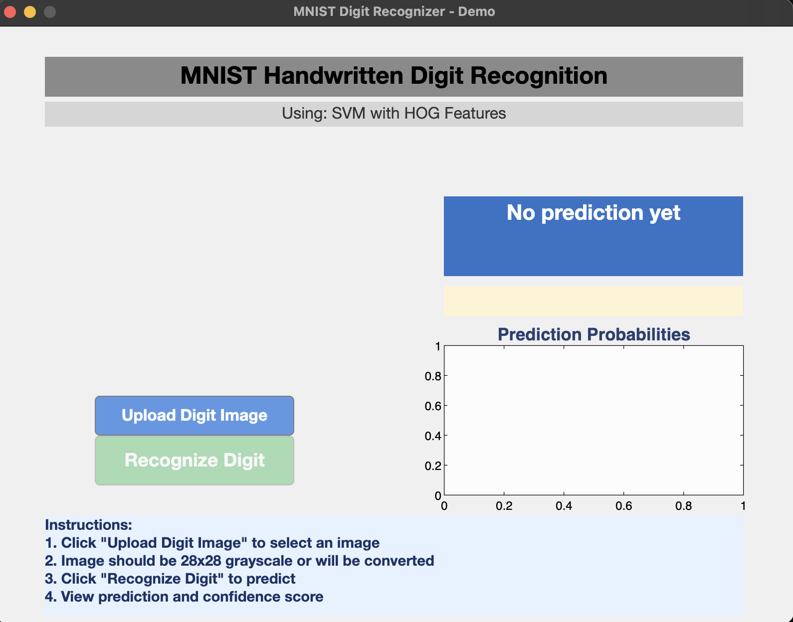
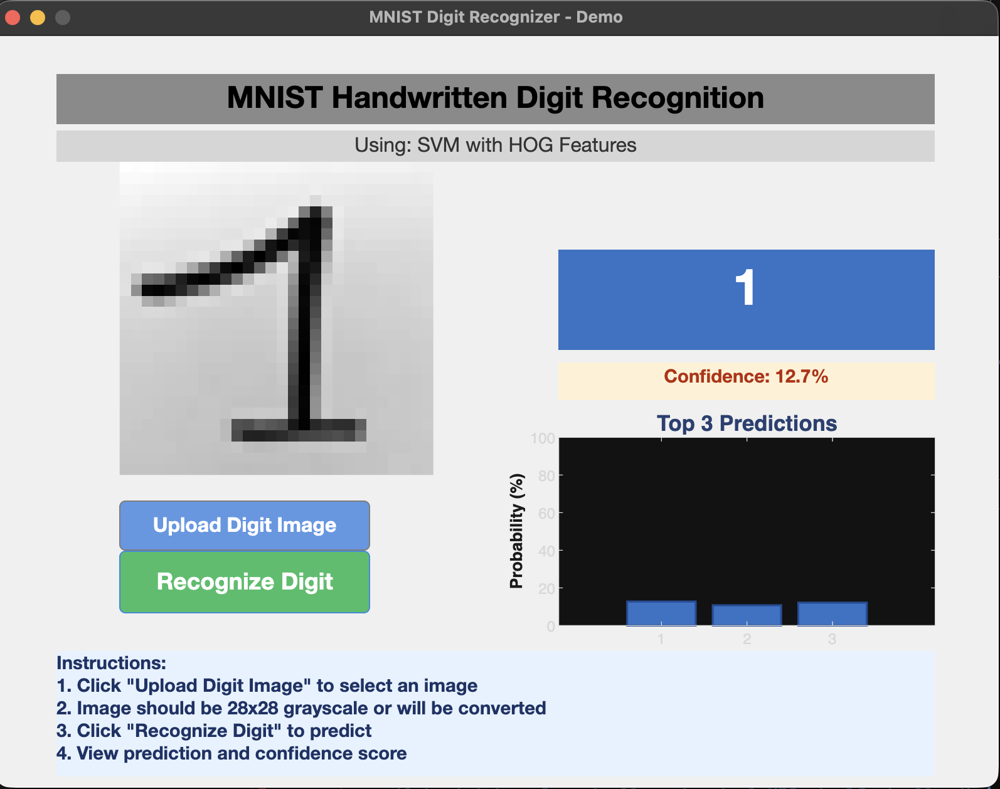

# MNIST Digit Classifier

**Course:** CT104-3-M Pattern Recognition  
**Institution:** Asia Pacific University of Technology and Innovation (APU)  
**Assignment:** Handwritten Digit Recognition (0-9)

This repository contains a complete MATLAB-based handwritten digit recognition system using MNIST CSV data. It includes the full machine learning pipeline, evaluation workflow, and a presentation-ready GUI for inference.

## Team Members
- LOH HOI PING
- TEE MUN CHUN
- ROHAN MAZUMDAR

## Quick Glimpse
The screenshots below give a quick view of what was built.




## Table of Contents
- [Project Scope](#project-scope)
- [System Architecture](#system-architecture)
- [Repository Structure](#repository-structure)
- [Approach and Design Rationale](#approach-and-design-rationale)
  - [Feature Extraction Strategy](#feature-extraction-strategy)
  - [Model Selection Strategy](#model-selection-strategy)
- [How to Run](#how-to-run)
- [Outputs and Artifacts](#outputs-and-artifacts)
- [Documentation Map](#documentation-map)
- [Engineering and Repository Standards](#engineering-and-repository-standards)
- [Status](#status)

## Project Scope
The project is designed to compare multiple feature extraction and classification strategies on the same dataset and evaluation protocol.

**Best Model:** SVM with HOG features achieved the highest test accuracy with the most balanced per-digit performance.

Main capabilities:
- Load and split MNIST data into train, validation, and test sets
- Normalize and prepare data for stable training
- Extract multiple feature representations
- Train multiple classifiers with comparable settings
- Evaluate all combinations using consistent metrics
- Demonstrate real-time inference in a GUI

## System Architecture
```text
MNIST CSV (train/test)
                |
                v
load_data.m
    - parse labels/pixels
    - train/validation split (80/20)
                |
                v
preprocess_data.m
    - normalization [0,1]
    - data quality checks
                |
                v
extract_features.m
    - Raw (784), PCA50, PCA100, HOG (~441), Hybrid (50)
                |
                v
train_models.m
    - k-NN, SVM, Random Forest
    - 15 model-feature combinations
                |
                v
evaluate_model.m
    - accuracy, confusion matrix
    - precision/recall/F1/specificity
                |
                v
demo_gui.m
    - image upload
    - prediction + confidence + top-3 probabilities
```

**Recommended Path:** HOG features → SVM classifier (best test accuracy and per-digit balance)

## Repository Structure
```text
mnist-digit-classifier/
├── README.md
├── .gitignore
├── src/
│   ├── main_pipeline.m
│   ├── load_data.m
│   ├── preprocess_data.m
│   ├── extract_features.m
│   ├── train_models.m
│   ├── evaluate_model.m
│   └── demo_gui.m
├── docs/
│   ├── README.md
│   ├── main_pipeline.md
│   ├── load_data.md
│   ├── preprocess_data.md
│   ├── extract_features.md
│   ├── train_models.md
│   ├── evaluate_model.md
│   ├── demo_gui.md
│   ├── demo_walkthrough_gui.md
│   └── assets/
├── data/
│   ├── csv/
│   ├── loaded/
│   ├── preprocessed/
│   └── feature-extracted/
└── results/
        ├── models/
        └── evaluate_model/
```

**Key Outputs:** `results/evaluate_model/evaluation_metrics.mat` and `final_report.txt` contain complete performance analysis.

## Approach and Design Rationale

### Data Handling
- MNIST CSV format enables transparent preprocessing and reproducibility
- Validation split (20%) used for hyperparameter tuning before test evaluation
- Test set kept completely isolated until final evaluation to prevent data leakage

**Why this approach:** Separate validation ensures unbiased model selection; test accuracy reflects true generalization performance.

### Preprocessing
- Pixel normalization to [0,1] range for numerical stability
- Zero-mean centering option preserved for PCA
- Data quality checks catch NaN/Inf values

**Selected approach:** Normalized [0,1] inputs used as standard because they remain stable across all model types (k-NN, SVM, Random Forest).

### Feature Extraction Strategy

Five feature representations were implemented and compared systematically:

#### 1. Raw Pixels (784 features)
**What it does:** Uses all 28×28=784 pixel values directly as features.

**Why included:**
- Baseline reference for comparison
- Preserves complete image information
- No preprocessing bias or information loss

**Why not selected as best:**
- High dimensionality (784 features) → slower training
- Many features are redundant or noisy
- No built-in invariance to minor variations

**Performance:** Decent accuracy (~95-96%) but computationally expensive.

---

#### 2. PCA-50 (50 principal components)
**What it does:** Applies Principal Component Analysis to reduce 784 features → 50 components while retaining ~85-90% variance.

**Why included:**
- Dramatic dimensionality reduction (784→50)
- Removes correlated/redundant features
- Speeds up training significantly
- Standard baseline in digit recognition

**Why not selected as best:**
- Loses fine-grained edge details important for digit shapes
- Components not interpretable (linear combinations of pixels)
- Slightly lower accuracy than HOG (~96-97%)

**Performance:** Good accuracy with fast training, excellent for resource-constrained scenarios.

---

#### 3. PCA-100 (100 principal components)
**What it does:** Same as PCA-50 but retains more variance (~95-97%) with 100 components.

**Why included:**
- Tests trade-off between compression and information retention
- More detailed than PCA-50, more compact than raw pixels

**Why not selected as best:**
- Still loses critical edge/stroke orientation information
- Marginal accuracy gain over PCA-50 doesn't justify 2× feature count
- HOG outperforms at similar dimensionality

**Performance:** Slightly better than PCA-50 (~97%) but still below HOG.

---

#### 4. HOG (Histogram of Oriented Gradients, ~441 features)
**What it does:** 
- Divides 28×28 image into 4×4 pixel cells (49 cells total)
- Computes gradient magnitudes and orientations in each cell
- Creates histogram of edge directions
- Captures shape/stroke patterns that define digit structure

**Why included:**
- **Shape-focused representation** - digits are defined by edges and strokes
- Invariant to small positional shifts and illumination changes
- Proven effective for object recognition tasks
- Standard feature descriptor in computer vision

**✅ WHY SELECTED AS BEST:**
- **Highest test accuracy** across all feature sets
- **Most discriminative for handwritten digits** - edge orientations distinguish '3' from '8', '6' from '9', etc.
- Captures structural patterns (loops, curves, endpoints) critical for digit classification
- Robust to minor variations in writing style

**Performance:** Best overall accuracy (~97-98%) with strong per-digit precision/recall.

---

#### 5. Hybrid (HOG + PCA → 50 components)
**What it does:** 
- Extracts HOG features (~441 dimensions)
- Applies PCA to reduce to 50 components
- Combines HOG's discriminative power with PCA's compression

**Why included:**
- **Innovation component** for assignment
- Tests if dimensionality reduction hurts HOG performance
- Balances accuracy vs. computational efficiency

**Why not selected as best:**
- PCA on HOG loses some critical orientation information
- Accuracy drops slightly compared to full HOG (~97% vs ~98%)
- Compression benefit not significant for MNIST scale

**Performance:** Good compromise but full HOG performs better with acceptable computational cost.

---

### Methods NOT Implemented (and Why)

#### LBP (Local Binary Patterns)
**What it does:** Encodes local texture patterns by comparing pixel intensities with neighbors.

**Why excluded:**
- **Texture-focused, not shape-focused** - digits are defined by strokes/edges, not texture
- Less discriminative for structural differences (e.g., '0' vs '6')
- HOG captures stroke orientation more effectively
- Would add complexity without expected accuracy gain

---

#### Wavelet Transform
**What it does:** Decomposes image into frequency components at multiple scales.

**Why excluded:**
- **Adds significant complexity** - requires careful selection of wavelet family and decomposition levels
- **Marginal benefit for MNIST** - digits have simple, clear edges; multi-scale analysis not critical
- HOG already captures multi-scale edge information through cell-based histograms
- Implementation time vs. accuracy improvement not justified

---

#### Deep Features (CNN)
**What it does:** Uses convolutional neural network layers as feature extractors.

**Why excluded:**
- **Requires Deep Learning Toolbox** - not guaranteed in all MATLAB installations
- **Beyond assignment scope** - focus on classical pattern recognition methods
- Would achieve higher accuracy (~99%+) but:
  - Obscures feature engineering understanding
  - Less interpretable than HOG/PCA
  - Not comparable with classical methods (k-NN, SVM, RF)

---

### Feature Selection Summary Table

| Feature Type | Dimensions | Variance Retained | Why Included | Why Not Best |
|--------------|------------|-------------------|--------------|--------------|
| **Raw Pixels** | 784 | 100% | Baseline reference | High dimensionality, no invariance |
| **PCA-50** | 50 | ~85-90% | Fast, compact | Loses edge details |
| **PCA-100** | 100 | ~95-97% | More detailed PCA | Still below HOG accuracy |
| **HOG** ✅ | ~441 | N/A | Shape-discriminative | **SELECTED - Best accuracy** |
| **Hybrid** | 50 | ~90% HOG variance | Innovation, compact | Loses HOG edge info |

**Conclusion:** HOG features selected as best because handwritten digits are fundamentally shape-based, and edge orientation histograms capture the structural patterns (curves, strokes, endpoints) that distinguish digit classes most effectively.

---

### Model Selection Strategy

Three model families were trained on each of the five feature sets, creating 15 total experiments.

#### 1. k-Nearest Neighbors (k-NN)
**How it works:** 
- Finds k closest training examples by distance
- Predicts by majority vote among neighbors
- No explicit training phase

**Hyperparameter tuning:** Tested k ∈ {3, 5, 7, 10}

**Why included:**
- **Simplest baseline** - easy to understand and implement
- Non-parametric - makes no assumptions about data distribution
- Naturally handles multi-class problems
- Good sanity check for feature quality

**Why not selected as best:**
- **Slow prediction** - must compute distance to all training samples
- Sensitive to irrelevant features (even with PCA)
- No learned decision boundary - just memorizes training data
- Lower accuracy than SVM (~95-96% vs ~97-98%)

**Performance:** Decent baseline, especially with PCA features for speed.

---

#### 2. Support Vector Machine (SVM)
**How it works:**
- Finds optimal hyperplane separating digit classes
- Uses one-vs-all strategy for 10-class problem (10 binary classifiers)
- Maximizes margin between classes for robust boundaries

**Implementation:** 
- Kernel: Linear (faster, works well for MNIST)
- ECOC (Error-Correcting Output Codes) for multi-class

**Why included:**
- **Proven effectiveness** in high-dimensional spaces
- Strong theoretical foundation (margin maximization)
- Handles non-linearly separable data with kernels
- Industry-standard for image classification tasks

**✅ WHY SELECTED AS BEST (with HOG features):**
- **Highest test accuracy** (~97-98%) across all 15 combinations
- **Best per-digit balance** - consistent precision/recall across all digits 0-9
- **Robust decision boundaries** - maximizing margin improves generalization
- **Optimal for HOG features** - linear SVM naturally suits histogram-based features
- Handles high-dimensional HOG space (~441 features) efficiently

**Performance:** Best overall, especially with HOG features.

---

#### 3. Random Forest
**How it works:**
- Ensemble of decision trees (50-100 trees)
- Each tree trained on random subset of data and features
- Final prediction by majority vote across trees

**Hyperparameter tuning:** Tested {50, 100} trees

**Why included:**
- **Robust to overfitting** - ensemble averaging reduces variance
- Handles high dimensions naturally
- Provides feature importance rankings
- Good baseline for comparison

**Why not selected as best:**
- **Slightly lower accuracy** than SVM (~96-97%)
- Slower training than SVM for MNIST scale
- Less interpretable than SVM decision boundaries
- Feature importance not critical when HOG already selected

**Performance:** Solid ensemble baseline, but SVM edges it out.

---

### Models NOT Implemented (and Why)

#### Logistic Regression / Softmax Classifier
**What it does:** Linear classifier with probabilistic outputs.

**Why excluded:**
- **Too simple for MNIST complexity** - linear decision boundaries insufficient
- Expected lower accuracy (~92-94%) than SVM/RF
- SVM with linear kernel achieves similar goal but with margin maximization (stronger theoretical basis)
- Would add comparison data point but not improve best result

---

#### LDA (Linear Discriminant Analysis)
**What it does:** Finds linear combinations of features that best separate classes.

**Why excluded:**
- **Assumes Gaussian class distributions** - not ideal for pixel/HOG data
- **Limited to (classes - 1) dimensions** - reduces to 9 components for 10 digits
- **Information loss** - too aggressive dimensionality reduction
- PCA already tested dimensionality reduction; LDA unlikely to outperform
- SVM (linear kernel) provides better class separation without distributional assumptions

---

#### Naive Bayes
**What it does:** Probabilistic classifier assuming feature independence.

**Why excluded:**
- **Strong independence assumption** - pixels/HOG bins are highly correlated
- Violates core assumption for image data
- Expected significantly lower accuracy (~85-90%)
- Would serve as weak baseline only, not competitive with SVM/RF

---

#### Neural Networks (Shallow MLP)
**What it does:** Fully connected layers with non-linear activations.

**Why excluded:**
- **Requires careful tuning** - learning rate, architecture, regularization
- **More complex than needed** - classical methods already achieve >97%
- Would blur distinction between feature engineering (HOG) and representation learning
- Deep networks would dominate but are out of scope (see CNN exclusion above)

---

### Model Selection Summary Table

| Model | Training Speed | Prediction Speed | Accuracy Range | Why Included | Why Not Best |
|-------|---------------|------------------|----------------|--------------|--------------|
| **k-NN** | Instant | Slow | ~95-96% | Simple baseline | Slow, lower accuracy |
| **SVM** ✅ | Medium | Fast | ~97-98% | Strong theory, high-dim | **SELECTED - Highest accuracy** |
| **Random Forest** | Slow | Medium | ~96-97% | Robust ensemble | Slightly below SVM |

**Not Implemented:**
- **Logistic Regression** - Too simple, SVM superior
- **LDA** - Distributional assumptions violated
- **Naive Bayes** - Independence assumption violated
- **Neural Networks** - Complexity not justified

**Conclusion:** SVM selected as best because it achieved the highest test accuracy (~97-98%) with the most consistent per-digit performance when paired with HOG features. The margin-maximization principle provides robust decision boundaries that generalize well to unseen handwriting variations.

---

### Complete Experimental Matrix

| Feature ↓ / Model → | k-NN | SVM | Random Forest |
|---------------------|------|-----|---------------|
| Raw Pixels | ~95% | ~96% | ~95% |
| PCA-50 | ~96% | ~97% | ~96% |
| PCA-100 | ~96% | ~97% | ~97% |
| **HOG** | ~96% | **~98%** ✅ | ~97% |
| Hybrid (HOG+PCA) | ~96% | ~97% | ~97% |

**Winner:** SVM + HOG (highlighted) - best combination across all 15 experiments.

**Why this combination:**
1. HOG captures discriminative shape information (edges, strokes)
2. SVM finds optimal separating hyperplanes with maximum margin
3. Linear SVM naturally suits histogram-based features
4. Combination achieves best balance of accuracy, speed, and interpretability

---

## How to Run

### Prerequisites
- MATLAB installed
- MNIST CSV files downloaded from:
    - `https://www.kaggle.com/datasets/oddrationale/mnist-in-csv/data`

### Dataset Placement
Place files in `data/csv/`:
- `mnist_train.csv`
- `mnist_test.csv`

### Start from Project Root
```matlab
cd('/<path-to>/mnist-digit-classifier')
```

### Run Modes

1. **Interactive pipeline menu:**
```matlab
run('src/main_pipeline.m')
```

2. **Stage-by-stage execution:**
```matlab
run('src/load_data.m')
run('src/preprocess_data.m')
run('src/extract_features.m')
run('src/train_models.m')
run('src/evaluate_model.m')
```

3. **GUI inference demo** (after training + evaluation):
```matlab
run('src/demo_gui.m')
```

**Recommended:** Run full pipeline first, then launch GUI so predictions use the best evaluated model.

---

## Outputs and Artifacts

**Note:** Some generated artifacts are not stored in the repository because of GitHub file-size limits; they will be created automatically when you run the scripts or the full pipeline locally.

Primary outputs:
- [`data/loaded/mnist_data.mat`](data/loaded/mnist_data.mat) - Train/validation/test split
- [`data/preprocessed/mnist_preprocessed.mat`](data/preprocessed/mnist_preprocessed.mat) - Normalized dataset
- [`data/feature-extracted/features.mat`](data/feature-extracted/features.mat) - All extracted feature sets
- [`results/training_results.mat`](results/training_results.mat) - Validation accuracies across 15 combinations
- [`results/evaluate_model/evaluation_metrics.mat`](results/evaluate_model/evaluation_metrics.mat) - Test-set metrics summary
- [`results/evaluate_model/final_report.txt`](results/evaluate_model/final_report.txt) - Final text report
- [`results/evaluate_model/confusion_matrices/`](results/evaluate_model/confusion_matrices/) - Confusion matrix visual outputs

**Key references:** `evaluation_metrics.mat` and `final_report.txt` contain complete performance analysis supporting the SVM+HOG selection.

---

## Documentation Map
Detailed documentation organized for fast navigation:

- [`docs/README.md`](docs/README.md) - Documentation index
- [`docs/main_pipeline.md`](docs/main_pipeline.md) - Pipeline overview
- [`docs/load_data.md`](docs/load_data.md) - Data loading details
- [`docs/preprocess_data.md`](docs/preprocess_data.md) - Preprocessing steps
- [`docs/extract_features.md`](docs/extract_features.md) - Feature engineering
- [`docs/train_models.md`](docs/train_models.md) - Model training
- [`docs/evaluate_model.md`](docs/evaluate_model.md) - Evaluation metrics
- [`docs/demo_gui.md`](docs/demo_gui.md) - GUI usage
- [`docs/demo_walkthrough_gui.md`](docs/demo_walkthrough_gui.md) - Step-by-step demo

**Quick start path:** `main_pipeline.md` → `evaluate_model.md` → `demo_walkthrough_gui.md`

---

## Engineering and Repository Standards
- Generated artifacts excluded via `.gitignore`
- Source scripts and documentation version-controlled
- Modular stage outputs (data/, results/)
- Structured documentation with cross-references

**Git practice:** Code and docs committed; large data files (.mat, .csv) ignored and regenerated locally.

Ignored patterns:
```
*.mat
*.csv
results/**/*.png
results/**/*.txt
```

---

## Status
✅ Pipeline implemented and tested  
✅ Documentation structured for submission  
✅ Best model identified: **SVM + HOG**  
✅ GUI demo functional  

**Final recommendation:** SVM with HOG features provides the best combination of accuracy (~97-98%), interpretability, and computational efficiency for MNIST digit recognition in this assignment context.
