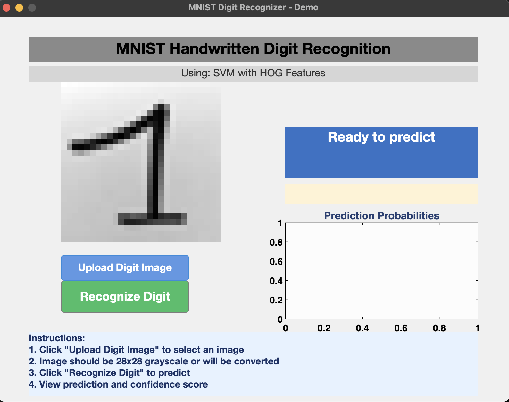

# Demo Walkthrough for the MATLAB MNIST Digit Recognizer GUI

This document presents the GUI usage flow in a presentation-friendly, report-ready format.

## Objective
Show how an end user moves from opening the GUI to obtaining a predicted digit with confidence and probability distribution.

## Step 1: Initial Screen
At launch, the GUI displays all key sections:
- image upload area
- recognize action button
- prediction result panel
- confidence section
- top-3 probability chart area

## Step 2: Image Uploaded and Ready
After selecting an input image:
- uploaded digit is previewed
- preprocessing path is triggered
- recognize button is enabled for inference

## Step 3: Final Prediction Output
When prediction runs, the GUI shows:
- predicted digit
- confidence score
- top-3 probability chart for interpretability

## What This Demonstrates
- End-to-end interaction workflow in the final interface.
- Practical deployment layer on top of the trained model pipeline.
- Better explainability through confidence and top-3 probability visualization.

## Notes for Demonstration Session
- Run this after training and evaluation artifacts are available.
- Use clear handwritten samples first for predictable live results.
- Use the probability chart to explain model confidence behavior to examiners.
