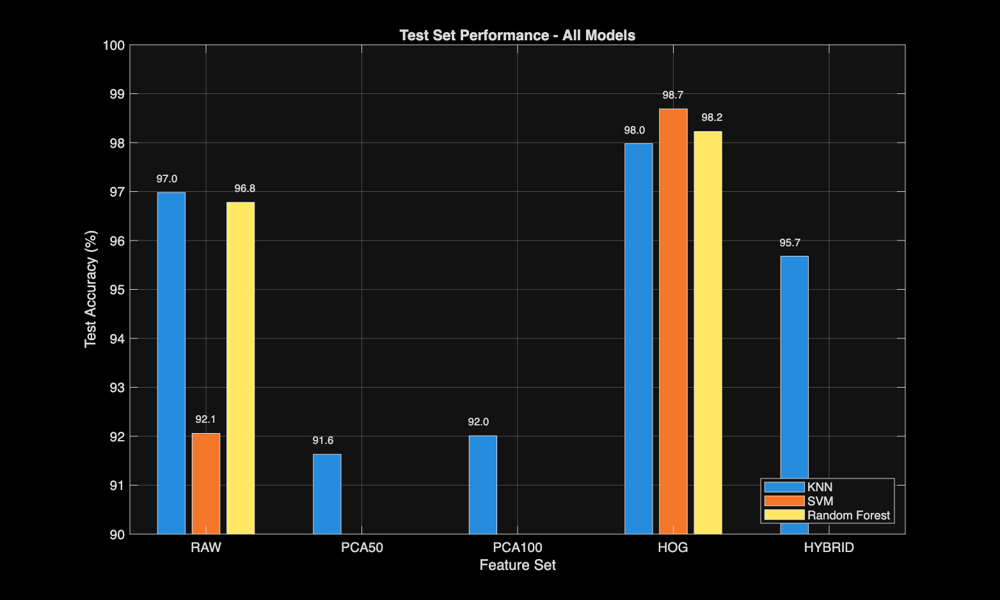
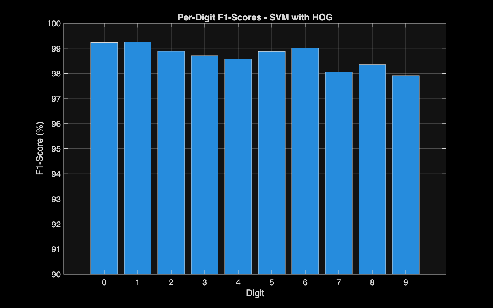
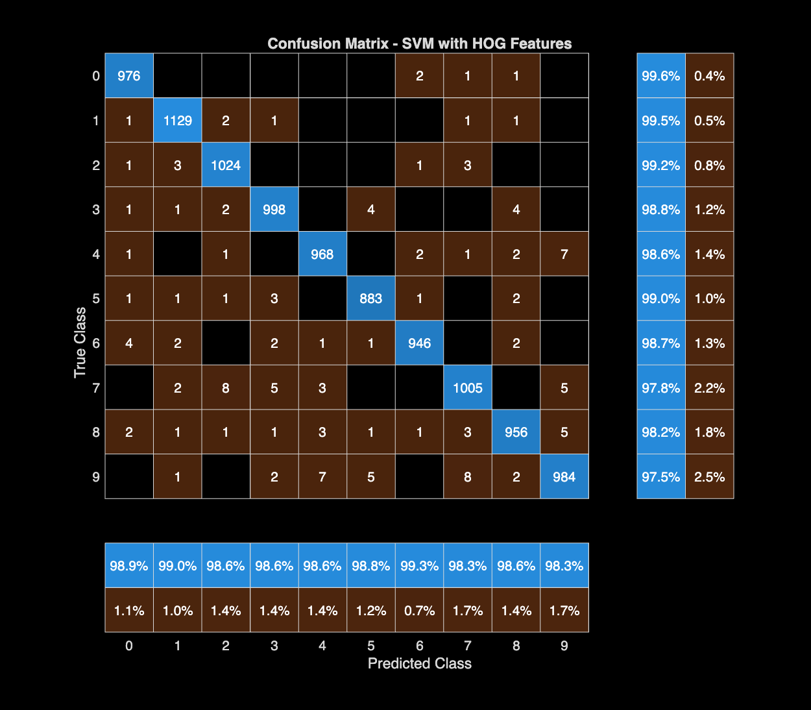

# `evaluate_model.m`

## What This Script Is
This stage evaluates all trained models on test data and generates report-quality metrics and visuals.

## What It Evaluates
For each model-feature pair, it computes:
- accuracy
- confusion matrix
- precision per digit
- recall per digit
- F1-score per digit
- sensitivity and specificity

## Process
1. Load test features.
2. Load trained models.
3. Predict labels on test set.
4. Compute metrics via helper function.
5. Find best test performer.
6. Save charts and final text report.

## Formula Explanations (Simple)
Accuracy:
`(TP + TN) / (TP + TN + FP + FN)`

Precision:
`TP / (TP + FP)`

Recall (Sensitivity):
`TP / (TP + FN)`

F1-score:
`2 * (Precision * Recall) / (Precision + Recall)`

Specificity:
`TN / (TN + FP)`

Where:
- `TP` = true positive
- `FP` = false positive
- `FN` = false negative
- `TN` = true negative

## Why This Is Assignment-Critical
This file gives the strongest evidence section for your report:
- objective comparison across all methods
- per-class behavior (which digits are harder)
- confusion patterns for analysis and discussion

## Output Files
- `results/evaluate_model/evaluation_metrics.mat`
- `results/evaluate_model/final_report.txt`
- `results/evaluate_model/confusion_matrices/*.png`
- `results/evaluate_model/test_accuracy_comparison.png`
- `results/evaluate_model/per_digit_performance.png`

## Snapshots From This Stage

### Test Accuracy Comparison
This chart compares test accuracy across all model and feature combinations.

### Per-Digit Performance
This chart shows F1-score behavior for digits 0-9 under the best model setup.

### Best Model Confusion Matrix
This confusion matrix helps explain which digits are commonly mixed up.

## Suggested Report Captions
"Figure: Test accuracy comparison across all model-feature combinations. SVM with HOG features gives the strongest generalization on unseen test data."

"Figure: Per-digit F1-score for the best model. Most classes perform near the top range, with small drops on visually similar digits."

"Figure: Confusion matrix of the best model. Errors are concentrated in a few look-alike pairs, showing where feature overlap still exists."
