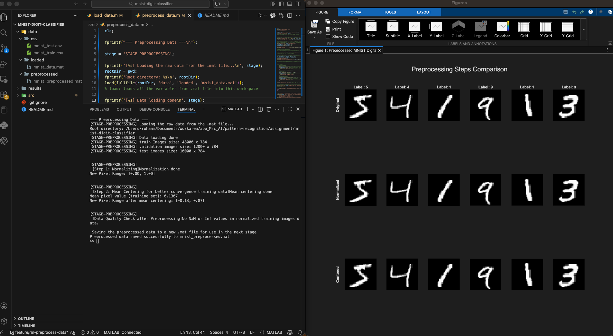

# `preprocess_data.m`

## What This Script Is
This script cleans and standardizes image values so downstream models can learn better.

## Main Steps
1. Load `data/loaded/mnist_data.mat`.
2. Normalize pixel values to range [0, 1].
3. Compute mean pixel value from training data.
4. Mean-center data (for analysis/visual checking).
5. Save normalized datasets to:
   - `data/preprocessed/mnist_preprocessed.mat`

## Why Preprocessing Is Needed
Raw pixel values are in [0, 255]. Many algorithms behave better when inputs are on similar scale.

Normalization makes optimization more stable and distances more meaningful.

## Easy Formula Explanations
Normalization:
`x_norm = x / 255`

Mean centering:
`x_centered = x_norm - mean(x_norm_train)`

Where:
- `x` is a pixel value
- `mean(x_norm_train)` is average pixel intensity from training data

## Important Design Decision in This File
The script saves normalized features (`train_images_norm`, etc.) for later stages.

Reason:
- k-NN, SVM, Random Forest, and HOG all work well with normalized data
- centered data is still computed and visualized, but normalized form is kept as main artifact

## Input and Output
Input:
- `data/loaded/mnist_data.mat`

Output:
- `train_images_norm`, `val_images_norm`, `test_images_norm`
- plus labels
- saved in `data/preprocessed/mnist_preprocessed.mat`

## Snapshot From This Stage
Preprocessing visualization generated from this project:

## Suggested Report Caption
"Figure: Preprocessing comparison on sample digits. The first row shows original images, the second row shows normalized images (0 to 1), and the third row shows mean-centered images. This confirms that preprocessing standardizes intensity scale while preserving digit shape information."
